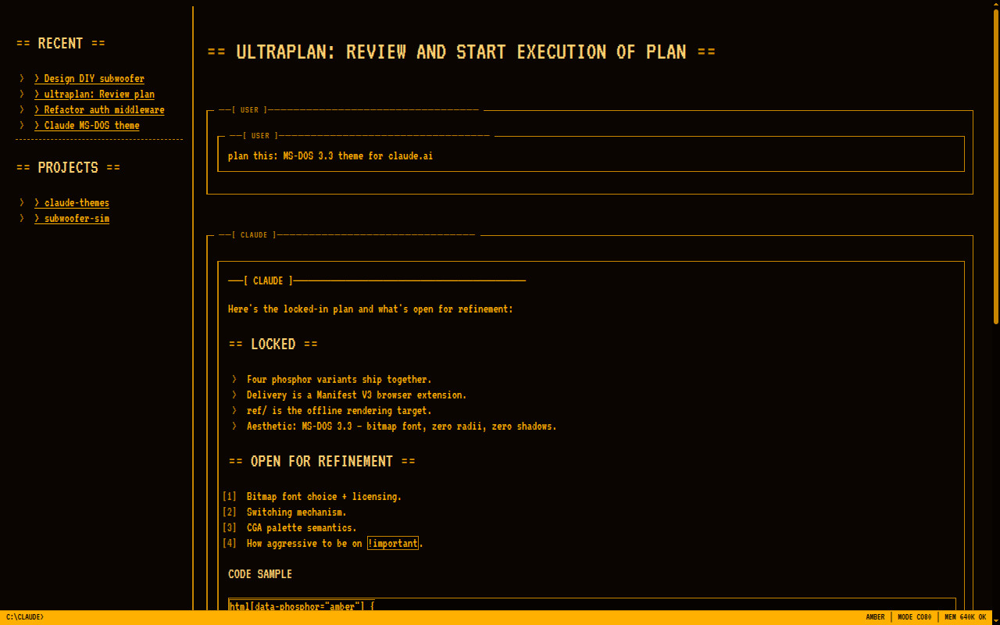
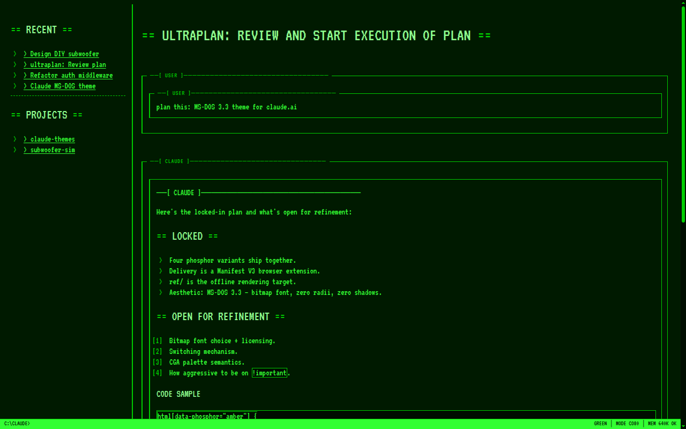
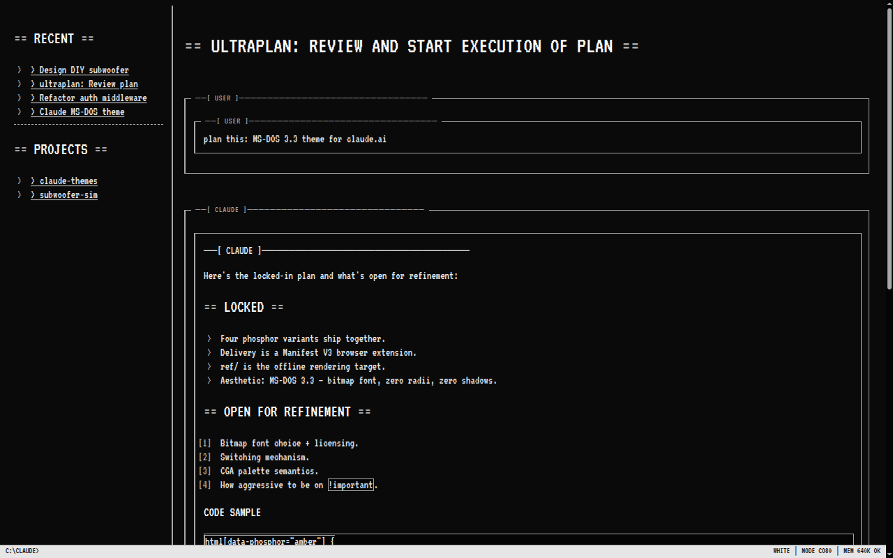
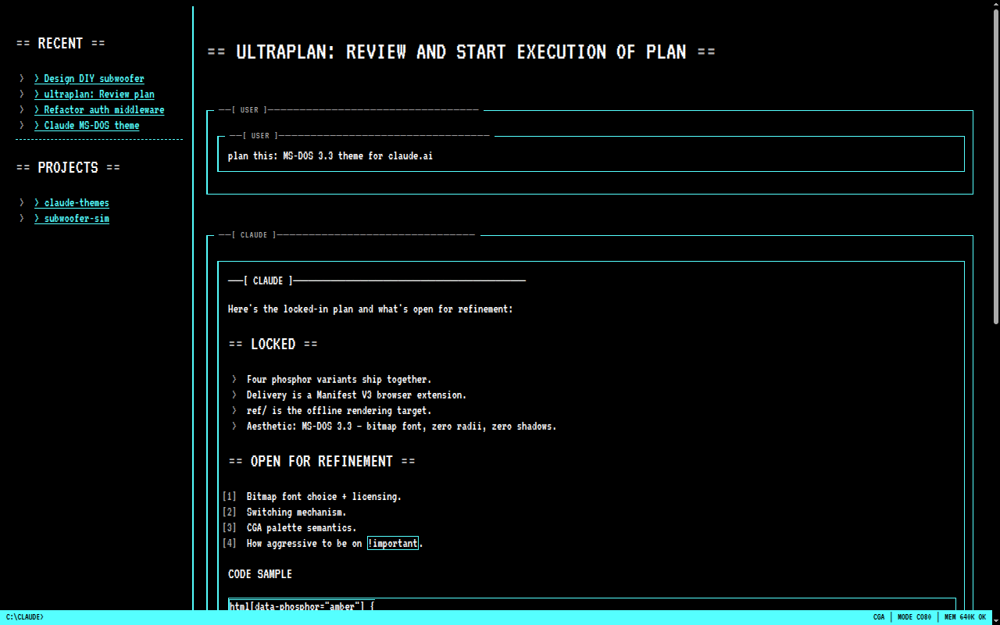
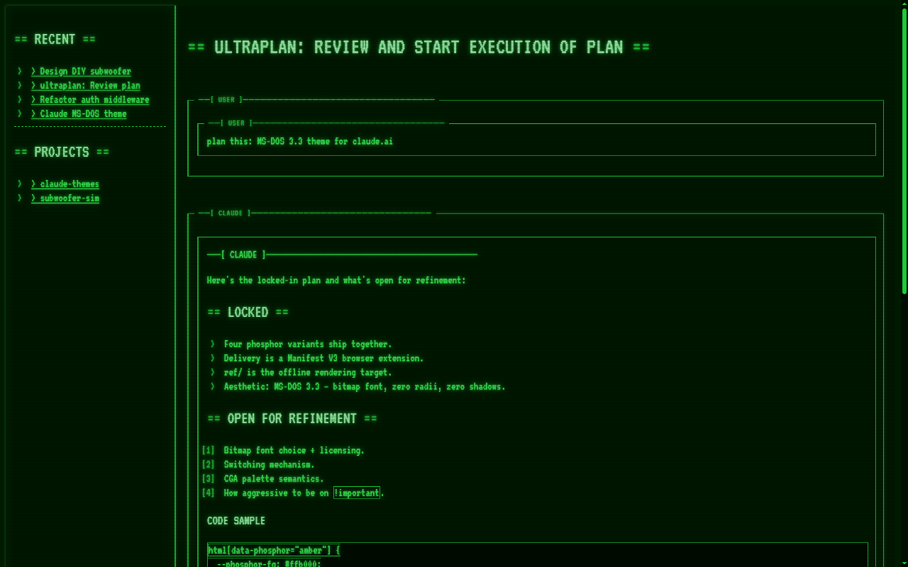

# Claude Themes

> A growing catalog of themes for [claude.ai](https://claude.ai). Assign a
> palette to each project — tab-glance your way between them.

six launch themes cycling on the same Claude conversation. See the full **[Theme Gallery →](docs/GALLERY.md)**

<table>
  <tr>
    <td></td>
    <td></td>
    <td></td>
  </tr>
  <tr>
    <td align="center">Amber</td>
    <td align="center">Green</td>
    <td align="center">White</td>
  </tr>
  <tr>
    <td></td>
    <td></td>
    <td></td>
  </tr>
  <tr>
    <td align="center">CGA</td>
    <td align="center">CRT</td>
    <td align="center">Synthwave</td>
  </tr>
</table>

## Why?

You run three Claude projects. They all look identical. You tab-hop into
the wrong one, scroll for 5 seconds, tab-hop back. Repeat all day.

Bind **Project A → Amber**, **Project B → CGA**, **Project C → Synthwave**.
Your peripheral vision does the context switching for you.

## The launch catalog (v0.2)

Six themes ship today; more in [GALLERY.md](docs/GALLERY.md).

| Theme         | Feel                                                   |
|---------------|--------------------------------------------------------|
| **Amber**     | IBM 5151 monochrome (1981). Warm, low-fatigue.         |
| **Green**     | Hercules P1 phosphor. Code-review classic.             |
| **White**     | MDA paper-white. High-contrast daylight.               |
| **CGA-4**     | Black / white / cyan / magenta. 1981 IBM PC defaults.  |
| **CRT**       | Green phosphor + scanlines + glow + BIOS boot flash.   |
| **Synthwave** | Neon grid + sunset sky + chrome. Outrun energy.        |

All themes share the same BBS chrome: bundled **VT323** bitmap font,
ANSI-box message frames (`──[ USER ]──` / `──[ CLAUDE ]──`), `>` bullets,
blinking █ block cursor, fixed `C:\CLAUDE>` status bar.

**➡️ Browse the full [Theme Gallery](docs/GALLERY.md)** — screenshots,
palettes (with hex), and the inspiration for each one.

## Install

**Chrome / Edge / Brave:**
1. Clone or download this repo.
2. `chrome://extensions` → toggle **Developer mode**.
3. **Load unpacked** → select `extension/`.
4. Open `claude.ai`, click the toolbar icon, pick a theme.

**Firefox (temporary):**
1. `about:debugging#/runtime/this-firefox`
2. **Load Temporary Add-on…** → pick `extension/manifest.json`.

No configuration. No external downloads. Fonts are bundled — you install
the extension and everything works.

Chrome Web Store + Firefox Add-ons listings coming — see
[docs/RELEASE.md](docs/RELEASE.md).

## Add your own theme

A theme is ~15 lines of CSS scoped under `html[data-phosphor="<name>"]`.
Copy `extension/variants/amber.css`, swap hex values, register it in four
places, open a PR.

Step-by-step in [docs/CONTRIBUTING.md](docs/CONTRIBUTING.md).

We welcome themes for real 1980s machines (Apple II, C64, Atari ST,
NeXT), classic DE palettes (Solarized, Nord, Dracula, Tokyo Night,
Gruvbox, Catppuccin), and anything else with a clear inspiration — cite
the source in the PR description.

## Offline preview

`preview/{amber,green,white,cga,crt,synthwave}.html` render each theme
against a synthetic claude.ai-shaped DOM. Open directly in a browser;
no extension reload needed.

## How it works

- `extension/content.css` defines the shared base: CSS custom-property
  overrides (radii, surfaces, fonts, text roles), Tailwind utility-class
  kills (`[class*="rounded"]`, `[class*="shadow"]`, `[class*="blur"]`,
  `[class*="bg-gradient"]`), ANSI-box message decorations, block cursor.
- `extension/variants/*.css` each scope a palette under their own
  `html[data-phosphor="X"]` attribute. All variants ship together; only
  the active one wins the cascade.
- `extension/content.js` reads the chosen theme from `chrome.storage.sync`
  at `document_start`, sets `data-phosphor` on `<html>`, listens for
  `storage.onChanged` so switches are instant with no reload.
- `extension/fonts/VT323-Regular.ttf` — OFL 1.1 bitmap font, bundled.

Zero telemetry, zero network calls, zero permissions beyond `storage` and
`https://claude.ai/*`.

## Per-tab binding

Open any non-root claude.ai tab. Click the extension icon. Tick
**"Use for this tab"** — the popup writes your theme choice only for
that URL's pathname. Other tabs keep whatever they were on; unbound
tabs use the default.

Scope key = `location.pathname` (e.g. `/code/session_01ABC`,
`/chat/abc`, `/project/foo`). Every distinct URL is its own stable
binding; new claude.ai sections work automatically with no extension
update.

Internally: `chrome.storage.sync` holds `{ default, perProject }` where
each key is a pathname. `content.js` polls `location.pathname` every
500ms (claude.ai navigates via `pushState` without reloading) and
reapplies the right theme when you move between tabs.

## Roadmap

- [ ] Chrome Web Store + Firefox AMO listings (see [RELEASE.md](docs/RELEASE.md)).
- [ ] Community themes: Solarized, Dracula, Nord, Apple II, C64,
      Atari ST, NeXT. Contributions welcome.
- [ ] Optional scanline toggle for non-CRT themes.
- [ ] Font picker (swap the base bitmap face).

## Contributing

- **Bug in a theme?** Open an issue with a screenshot and the theme name.
- **New theme?** See [CONTRIBUTING.md](docs/CONTRIBUTING.md).
- **New feature?** Open an issue first to discuss scope.

CSS-only changes are the easy path — edit the relevant `variants/*.css`
or `content.css`, refresh the preview page, screenshot the before/after,
open a PR.

## License

- **Extension code** (HTML, CSS, JS): MIT.
- **VT323 font** (bundled): SIL Open Font License 1.1. See
  [extension/fonts/OFL.txt](extension/fonts/OFL.txt).
- **Contributed themes**: accepted under MIT unless the author specifies
  a compatible license and credits their palette source.

## Credits

- **VT323** — Peter Hull, OFL 1.1.
- **Oldschool PC Font Pack** — VileR, [int10h.org](https://int10h.org/oldschool-pc-fonts/).
  We don't bundle MxPlus directly (licensing audit pending), but VT323 is
  inspired by the same VGA bitmap heritage.
- BBS ANSI-art conventions from a thousand 1990s sysops.

---

Claude Themes is an unofficial community project. Not affiliated with, endorsed by, or sponsored by Anthropic. "Claude" is a trademark of Anthropic, PBC.
