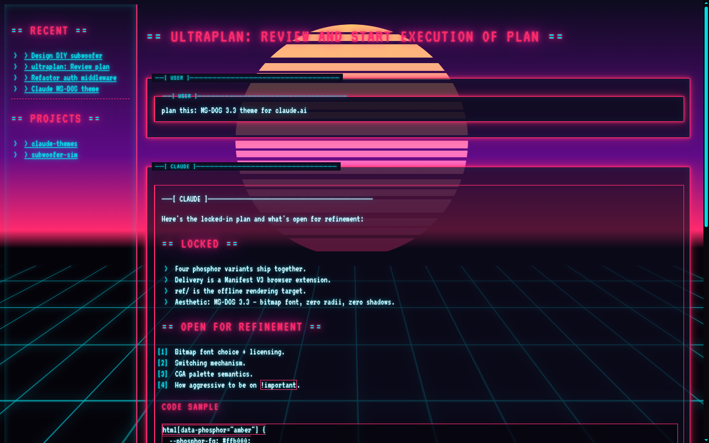

# Theme Gallery

Every theme currently shipping in **Claude Themes**, with the real
inspiration, palette hex codes, and one-line guidance on when each
reads best.

Screenshots are captured against the same claude.ai conversation so only
the palette varies. If a screenshot is missing, it's a capture-pending
placeholder — see `docs/assets/` and `docs/ASSETS.md` for the shoot plan.

---

## Amber

IBM 5151 monochrome display (1981). The amber phosphor was marketed as
"less fatiguing" than green for long sessions — a claim that's half true
and completely nostalgic.

| Role           | Hex       | Swatch                                                                 |
|----------------|-----------|------------------------------------------------------------------------|
| Background     | `#0a0500` |              |
| Raised surface | `#1a0d00` |              |
| Foreground     | `#ffb000` |              |
| Dim            | `#c88500` |              |
| Bright         | `#ffd070` |              |
| Destructive    | `#ff6030` |              |

**Best for:** long writing sessions, late-night coding, anyone who has
ever looked at a CRT past 2am.
**Inspiration:** IBM 5151 datasheet + a photo of one running WordPerfect 4.2.

---

## Green

Hercules Graphics Card / generic P1 phosphor. The color of every CS lab
from 1982 to 1988.

| Role           | Hex       | Swatch                                                                 |
|----------------|-----------|------------------------------------------------------------------------|
| Background     | `#001a00` |              |
| Raised surface | `#002800` |              |
| Foreground     | `#33ff33` |              |
| Dim            | `#00cc00` |              |
| Bright         | `#90ff90` |              |
| Destructive    | `#ff5555` |              |

**Best for:** code review, reading long responses, matrix-rain energy.
**Inspiration:** Hercules HGC @ IBM 5151.

---

## White

IBM Monochrome Display Adapter / paper-white phosphor. Closest to modern
"light mode" but with a fixed-pitch heart.

| Role           | Hex       | Swatch                                                                 |
|----------------|-----------|------------------------------------------------------------------------|
| Background     | `#0a0a0a` |              |
| Raised surface | `#151515` |              |
| Foreground     | `#e6e6e6` |              |
| Dim            | `#a8a8a8` |              |
| Bright         | `#ffffff` |              |
| Destructive    | `#ff8080` |              |

**Best for:** high-contrast daylight reading, screen-sharing, eye breaks
from amber/green.
**Inspiration:** MDA paper-white phosphor tubes.

---

## CGA-4

IBM CGA Palette 1 (high-intensity): black, white, cyan, magenta. The
screen everyone's grandparent shipped on.

| Role           | Hex       | Swatch                                                                 |
|----------------|-----------|------------------------------------------------------------------------|
| Background     | `#000000` |              |
| Foreground     | `#ffffff` |              |
| Accent (cyan)  | `#55ffff` |              |
| Destructive    | `#ff55ff` |              |

**Semantic mapping:** white = body, cyan = links/accents/borders,
magenta = errors/destructive, black = bg.
**Best for:** short bursts, "I need to be alert" sessions, King's Quest
energy.
**Inspiration:** IBM CGA Technical Reference, 1984.

---

## CRT

Green phosphor + period-correct CRT effects: fixed scanline overlay,
text-shadow phosphor glow, subtle brightness flicker, one-shot BIOS boot
screen on page load.

| Role           | Hex       | Swatch                                                                 |
|----------------|-----------|------------------------------------------------------------------------|
| Background     | `#001a00` |              |
| Foreground     | `#39ff55` |              |
| Dim            | `#1ccc33` |              |
| Bright         | `#b0ffc0` |              |

Effects on top of the base green palette:
- **Scanlines:** 1px alternating rows at 35% multiply opacity.
- **Phosphor glow:** multi-layer `text-shadow`, 4–10px radii.
- **Flicker:** ~3% brightness oscillation every 140ms + larger jolt every 8s.
- **Boot screen:** AMI BIOS POST text fades out over 2.4s on first paint.

**Best for:** full immersion. Not for long sessions (the flicker is
real). Great for demos and showing off.
**Inspiration:** every 1987 CRT ever owned by anyone's dad.

---

## Synthwave

The catalog's only non-monochrome theme. Neon pink/cyan/magenta on a
sunset-gradient sky, with a CSS-rendered perspective grid floor that
animates toward the horizon and an outrun sun cut by masked horizontal
stripes.

| Role            | Hex       | Swatch                                                                 |
|-----------------|-----------|------------------------------------------------------------------------|
| Sky top         | `#0d0b1e` |              |
| Sky mid         | `#5f0a87` |              |
| Horizon         | `#ff2a6d` |              |
| Ground          | `#05030a` |              |
| Cyan (body glow)| `#05d9e8` |              |
| Pink (accent)   | `#ff2a6d` |              |
| Magenta         | `#ff00e1` |              |

**Best for:** when the product is a vibe. Ship it Friday afternoon with
lo-fi in the background.
**Inspiration:** early outrun aesthetic (Miami Vice title cards, Lazerhawk
album covers, [Kavinsky "Nightcall" music video](https://www.youtube.com/watch?v=MV_3Dpw-BRY)).

---

# Wishlist — themes we'd love PRs for

Vote / pick one by opening an issue, then a PR per
[CONTRIBUTING.md](CONTRIBUTING.md).

## 1980s hardware palettes

- **Apple II** — green / black + Applesoft-era inverted brackets
- **Commodore 64** — pastel blue-on-blue (`#7869C4` on `#3F2D8B`)
- **Atari ST** — that unmistakable `#00AAAA` desktop gray + `#FF0000`
  accents from GEM
- **NeXT Cube** — blacks, grays, a single teal accent — the Jobs school
- **Macintosh Classic** — pure 1-bit B&W + Chicago-bold headings
- **BBC Micro / Acorn Archimedes** — mode 7 teletext colors

## Classic developer palettes (community darlings)

- **Solarized Dark** / **Solarized Light**
- **Dracula**
- **Nord**
- **Tokyo Night** (storm variant)
- **Gruvbox**
- **Catppuccin** (mocha)
- **Rosé Pine**
- **Everforest**
- **One Dark / Atom**
- **Monokai**

## Aesthetic categories

- **Cyberpunk 2077** — yellow-on-black, sharp angles, Night City HUD vibes
- **Blade Runner 2049** — amber + teal + fog overlay
- **Vaporwave** (distinct from synthwave — pastel pink/blue, A E S T H E T I C)
- **Terminal Green** (actually Matrix-flavored, with falling-character hero)
- **NES** — red/white/gray with 8-bit bitmap font
- **WarGames** — pure green WOPR — "Shall we play a game?"

## Submit new palettes

Open an issue with:
- Theme name
- 6–8 hex codes (bg, raised, inset, fg, fg-dim, fg-bright, accent, destructive)
- One sentence on inspiration / source (datasheet, photo, album cover,
  color standard)
- A mood screenshot from the inspiration

Then open a PR — see [CONTRIBUTING.md](CONTRIBUTING.md).
