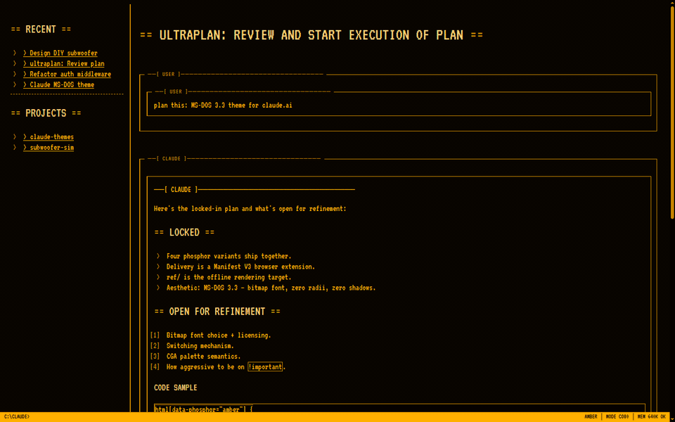

# Claude Themes

> Retro themes for [claude.ai](https://claude.ai). Bind a palette per project so tabs are distinguishable at a glance.

## Six themes ship today

- **Amber** — IBM 5151 monochrome, the original 1981 phosphor
- **Green** — DEC VT220 / Hercules, terminal workhorse
- **White** — Macintosh-era high-contrast paperwhite
- **CGA** — 4-color, cyan + magenta + white on black
- **CRT** — full shader: scanlines, vignette, phosphor bloom
- **Synthwave** — hot pink and cyan on deep violet, 1984 in a browser

## Links

- **Source code:** [github.com/clausqr/claude-themes](https://github.com/clausqr/claude-themes)
- **Theme gallery:** [GALLERY](GALLERY)
- **Privacy policy:** [PRIVACY](PRIVACY)
- **Contributing:** [CONTRIBUTING](CONTRIBUTING)

## Install

Chrome Web Store and Firefox AMO listings — coming this week. Until then, load the unpacked `extension/` directory in your browser's developer mode.

> **Pro tip:** hit `F11` for browser fullscreen. The browser chrome disappears, the BBS chrome takes over the whole monitor, and you're back in 1987.

---

Claude Themes is an unofficial community project. Not affiliated with, endorsed by, or sponsored by Anthropic. "Claude" is a trademark of Anthropic, PBC.
